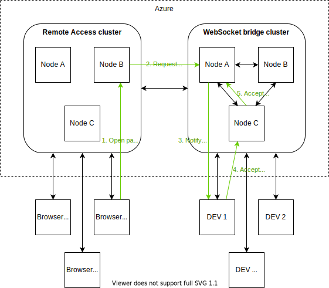

# WebSocket Bridge
Microsoft announced [IoT Hub Device Streams](https://docs.microsoft.com/en-us/azure/iot-hub/iot-hub-device-streams-overview) in January 2019 allowing bidirectional  stream-based communication with a device connected to IOT hub. Although the idea is great, the current implementation of Device Streams has some severe limitations:

 1. Preview status (for more than a year).
 2. Only available in selected regions (this might get better once it has general availability status).
 3. Unknown pricing when it gets GA status.
 4. Maximum of 50 concurrently connected device streams.
 5. Maximum of 300MB device stream data transfer (per day).
 6. Maximum of 5 new streams per second, which may be too limited when using HTTP over device streams. HTTP/1.1 tends to open multiple TCP streams to speed up page loading.

Most of these limitations may be lifted when Device Streams will have general availability status, but using WebSocket Bridge may have some additional benefits:

 1. Allows passing data when requesting the bridge.
 2. Allows hosting of the bridge outside Azure, which may significantly reduce ingress/egress costs.
 3. The WebSocket Bridge server can be Dockerized for easy deployment.
 4. Stateless multi-node support for easy horizontal scaling without additional requirements.
 5. Can be run inside a Kubernetes cluster.

# Architecture
The WebSocket Bridge is fully based on WebSocket connections and is independant of IOT hub. The following picture shows the overall architecture:

In this picture the *WebSocket bridge* is used by the *Remote Acess website* to establish an HTTP bridge to allow the end-user to connect via his webbrowser to an IOT device. This solution also requires some HTTP proxying functionality, but that's outside the scope of this topic. It only focuses on the HTTP bridge between the remote maintenance cluster an the IOT device. When the user opens a web-page, then the following flow is used:

1. The user opens the page that displays the home page of XPAC 1.
2. The remote access node detects that it needs to create an HTTP bridge to device 1 and request a bridge from the WebSocket Bridge cluster. This request is a (secured) websocket connection that uses the url `wss://websocketbridge.example.com/bridge/connect?deviceId=dev1?requestData=-somedata-`. The websocket is accepted by the websocket bridge cluster (in this example, it's node A).
3. The node creates a *bridge token* that uniquely identifies the bridge. This token looks like a random string on the outside, but it's actually the node's internal address that has been encrypted (some randomness is added to ensure a unique token for each request). It saves the token in its node-specific administration and signals DEV 1 that a bridge is requested. It passes the URL to accept the bridge (i.e. `wss://websocketbridge.example.com/bridge/accept?bridgeToken=-bridgetoken-inserted-here-&requestData=-somedata-`). This signalling is done using a secondary channel, because a websocket cannot reach the device directly (if it's behind a firewall and/or NAT router). This is where IOT Hub steps in, becauwe IOT hub cloud-to-device message can inform the device about the bridge.
4. The device receives the request and if it accepts the bridge, then it creates a websocket and connects to the accept URL.
5. The accept bridge socket is received by the websocket bridge cluster (in this example, on node C), but node C doesn't know about the bridge-token. The bridge-token is only known in the administration of node A. It then decodes the bridge-token and it determines that the bridge was requested by node A. It then forwards the websocket accept to node A.
6. Node A receives the accept bridge websocket and knows about the bridge-token. It bridges both websockets and a bidirectional connection between the remote access cluster and the IOT device has been created.

In some cases the remote maintenance cluster and the XPAC will reach the same node in the websocket bridge. In that case, step 5 is skipped and the nodes are connected directly.

We used HTTP in this example, but any binary stream can be used. All use-cases that are valid for device streams are valid for the WebSocket Bridge as well (i.e. tunnel SSH connection to an IOT device).

# Development
The WebSocket Bridge is currently under active development. I will publish NuGet packages, once the code is mature enough for production use.

# Example code
Example code that implements a (simulated) IOT device and a TCP tunnel will be published soon.

# Pull requests welcome
I am happy to accept pull requests and/or receive feedback.